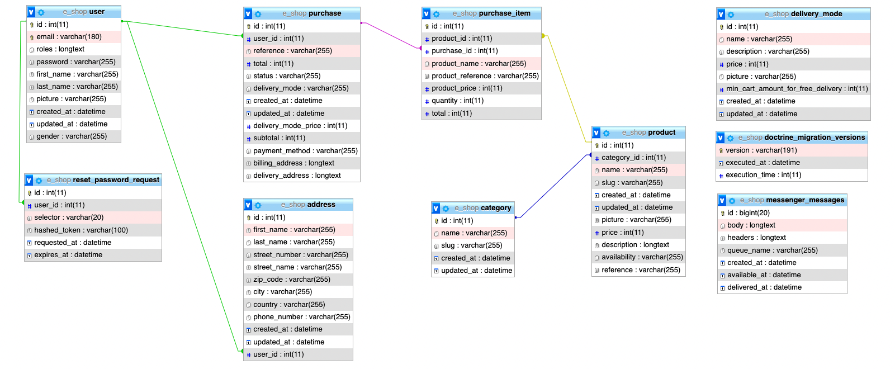

# E-Shop 🛒

The **E-Shop** project is demo of a e-commerce application that I develop in order to practice the web developement langagues and increse my knowledge.

## 🧰 **Stack**

- **Languages**

  - Front  
      
  - Back  
     

- **Relational Database Management System**

  

- **Administration Tool**

  

- **Framework**

  

- **Source-Code Editor**

  

## ⚙️ Database & Set Up

The E-Shop-Symfony project use the **MariaDB** Relational Database Management System in its verion 10.7.3.  
 The structure of the database is the following :

<!-- To use the projet you have to follow this steps :

- Git clone the repository -->

## 👀 Glimpse

▶️ E-Shop - Mobile tour with a administrator role :  

▶️ E-Shop - Desktop tour with a administrator role :  

